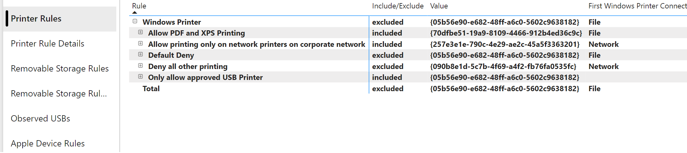
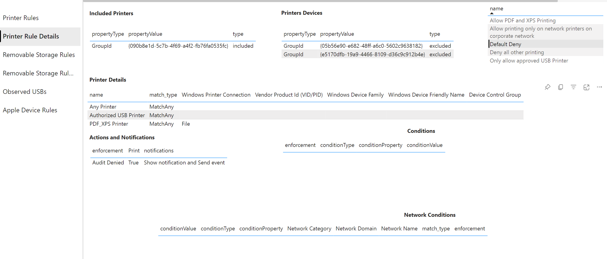
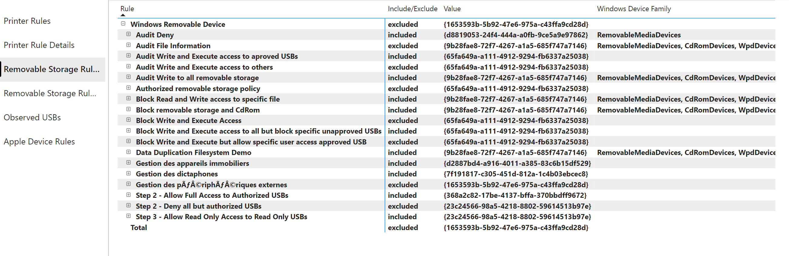
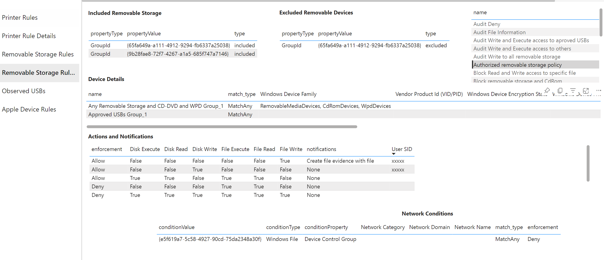
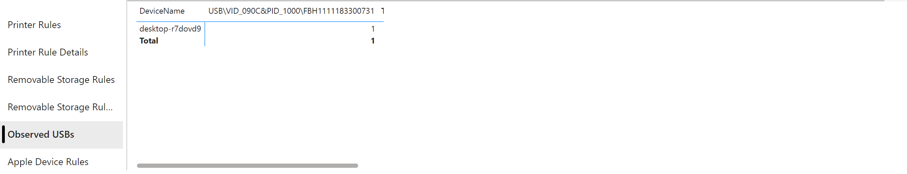
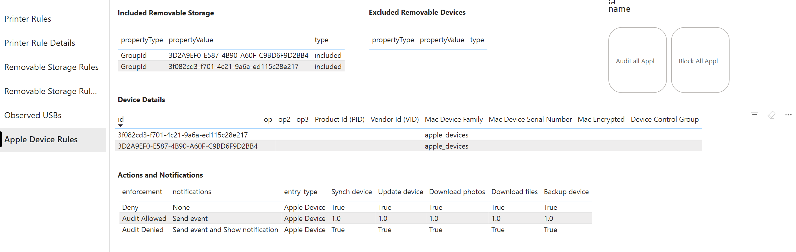

# Device Control Power BI Dashboard

The dashboard contains:
-   Device control rules and groups from local CSVs
-   USBs that have been observed by MDE

## Set-up

1.  Launch [Power BI Desktop](https://powerbi.microsoft.com/en-us/desktop/)
2.  Choose  **File** > **Open** > [devicecontrol.pbix](devicecontrol.pbix)
3.  Edit the *Inventory Source* parameter by navigating to **Home** > **Transform Data** > **Edit Parameters**.  Set it to the location of the CSV files containing the inventory report.  For this repo, this is the *powerbi* directory that contains *devicecontrol.pbix*
4. Edit the credentials for *https://api.securitycenter.microsoft.com/api/advancedqueries* by navigating to **Home** > **Transform Data** > **Data source settings**.  Select *https://api.securitycenter.microsoft.com/api/advancedqueries* and click **Edit Permissions...**.  Under **Credentials** click **Edit...**.  Select *Organizational Account* and sign-in.
5. Load the data by clicking **Home** > **Refresh**

## Generating Local CSVs
The CSVs are the output of the [device control doc tool](../python/README.md#dcdocpy) CSV report. Use the ```--format=csv``` parameter.  See an example below for the full set of parameters.

<details>
<summary>VSCode config - Generate csv report on files</summary>

```json
{
    "name": "Python: dcdoc csv report",
    "type": "python",
    "request": "launch",
    "program": "${workspaceFolder}\\python\\dcdoc.py",
    "args": [
        "--path=${workspaceFolder}\\windows;${workspaceFolder}\\macOS",
        "--format=csv",
        "--dest=${workspaceFolder}"
    ],
    "console": "integratedTerminal",
    "justMyCode": true,
}
```
        
</details>

## Reports
The dashboard contains the following reports:

| Report | Source |Description |
|----    |----    |---
| [Printer Rules](#printer-rules) | Local CSV | Lists all of the Windows printer rules and groups |
| [Printer Rules Details](#removable-storage-rules-details) | Local CSV |Details on the entries, groups, and conditions associated with a Windows printer rule|
| [Removable Storage Rules](#removable-storage-rules) | Local CSV | Lists all of the Windows removable storage rules and groups |
| [Removable Storage Rule Details](#removable-storage-rules-details) | Local CSV | Details on the entities, groups, and conditions associated with a Windows removable storage rule |
| [Observed USBs](#observed-usbs)| MDE | A matrix of removable media devices (USBs) ids (instancepath) to endpoints |
| [Apple Device Rules](#apple-device-rules) | Local CSV | Details on the entries and groups associated with Apple device rules |

### Printer Rules


### Printer Rules Details


### Removable Storage Rules


### Removable Storage Rules Details


### Observed USBs


This report [connects the MDE API to Power BI](https://learn.microsoft.com/en-us/microsoft-365/security/defender-endpoint/api/api-power-bi?view=o365-worldwide#connect-power-bi-to-advanced-hunting-api).

It uses the following advanced hunting query:

```
let selectedTimestamp = now();
search in (DeviceEvents)
Timestamp between ((selectedTimestamp - 7d) .. (selectedTimestamp))
| where ActionType == "PnpDeviceConnected"
| extend parsed=parse_json(AdditionalFields)
| extend RemovableStorageAccess = tostring(parsed.RemovableStorageAccess)
| extend RemovableStoragePolicyVerdict = tostring(parsed.RemovableStoragePolicyVerdict)
| extend MediaBusType = tostring(parsed.BusType)
| extend MediaClassGuid = tostring(parsed.ClassGuid)
| extend MediaClassName = tostring(parsed.ClassName)
| extend MediaDeviceId = tostring(parsed.DeviceId)
| extend MediaInstanceId = tostring(parsed.DeviceInstanceId)
| extend MediaName = tostring(parsed.MediaName)
| extend RemovableStoragePolicy = tostring(parsed.RemovableStoragePolicy)
| extend MediaProductId = tostring(parsed.ProductId)
| extend MediaVendorId = tostring(parsed.VendorId)
| extend MediaSerialNumber = tostring(parsed.SerialNumber)
| where MediaClassName == "USB"
```

You can also access the datasource in Power BI via the [.pbids file](api.securitycenter.microsoft.com.pbids).  

### Apple Device Rules



